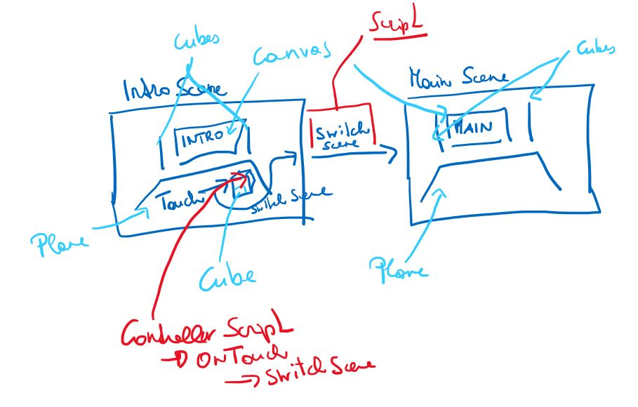
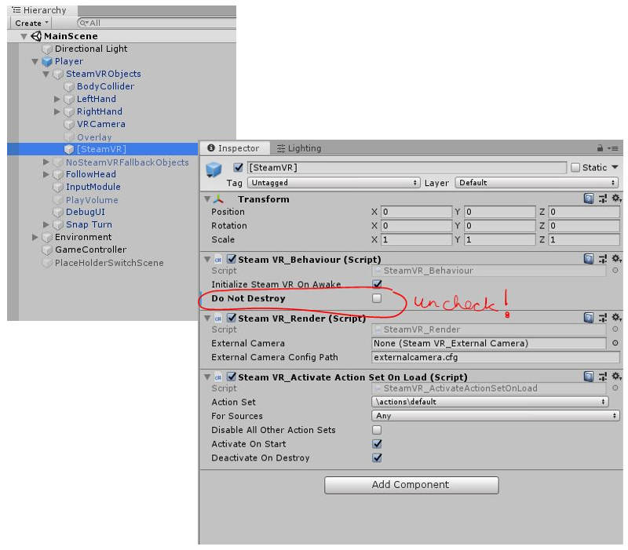

# smeerws-LoadSceneSteamVR

### Project description: 
This little 3D VR (using SteamVR) project demonstrates a scene switch implemented with c#. 
Therfore the project contains two scenes, an IntroScene and a MainScene and a Script SwitchScenes.
In the IntroScene the VR user has to touch a green cube to switch to the MainScene. 
 
### Development platform: 
Windows 10, 
Unity 2019.1.14f1, 
Visual Studio community 2017 version 15.9.17, 
SteamVR Plugin 2.5.0 (sdk 1.8.19), 
Scripting Runtime Version: .NET 4.x Equivalent

### Target platform: 
Oculus Rift S/Rift/Vive

### Visuals: 

### Necessary setup/execution steps: 
You need Unity, SteamVR Plugin (imported and installed), a Rift/Vive/Rift S.
Clone the project, run the project. 

### Third party material: 
Informative Tutorials I have used to implement this project: 
+ Switch Scene: https://medium.com/@setzeus/steamvr-2-0-tutorial-scene-switch-2b2905591813
+ Touch interacton in Intro Scene: Simple Interaction in Interaction_Example Scene located in Assets > SteamVR > InteractionSystem > Samples 
+ SteamVR: https://valvesoftware.github.io/steamvr_unity_plugin/articles/Interaction-System.html

### Project state: 
incl. progress in percent

### Limitations: 

None
### Lessons Learned: 
+ Using the existing Interactable Script from SteamVR to implement touching a cube.
+ Using the existing SteamVR_LoadLevel Script to switch between senes: 
  Registering Scenes & Triggering A Scene Change, add scenes to build settings, create a placeHodler Object and 
  drag the SteamVR_LoadLevel script onto it. For an unpolished scene switch enter the target scene name to Level Name in the
  Inspector and enalbe Auto Trigger On (when the script is triggered). Next, when the cube is touched, the placeHolder object is
  set active and the scene will be switched. 
+ Problem: Multible Players in scene after scene switch (in intro scene): The player is implemented as singelton. 
  Solution 1: Use the Player with the DontDestroyOnLoad: create a player in an intro scene, switch to other secenes (no players in other scenes), and never load this intro
  scene again. 
  Solution 2: Create in every single scene a new Player. Disable in the [SteamVR] object the Do not Destroy (uncheck property)
  

Copyright by smeerws
